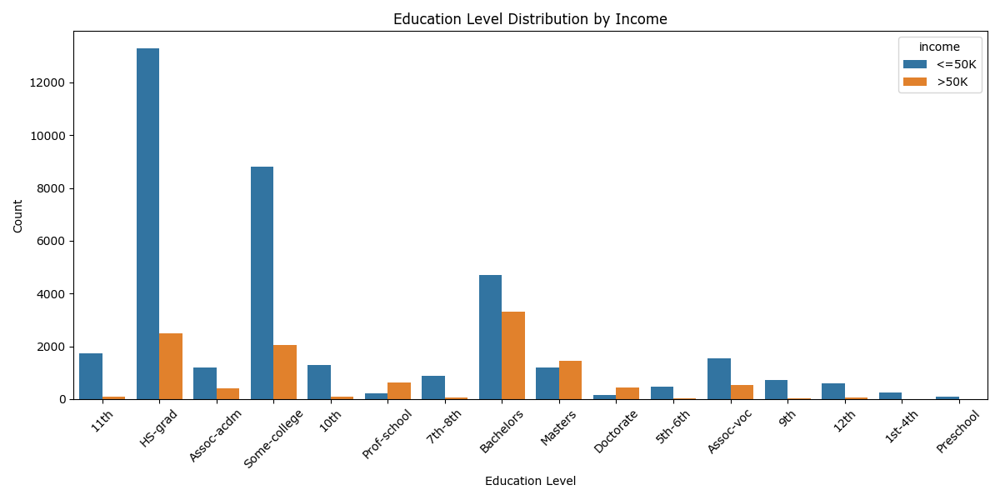
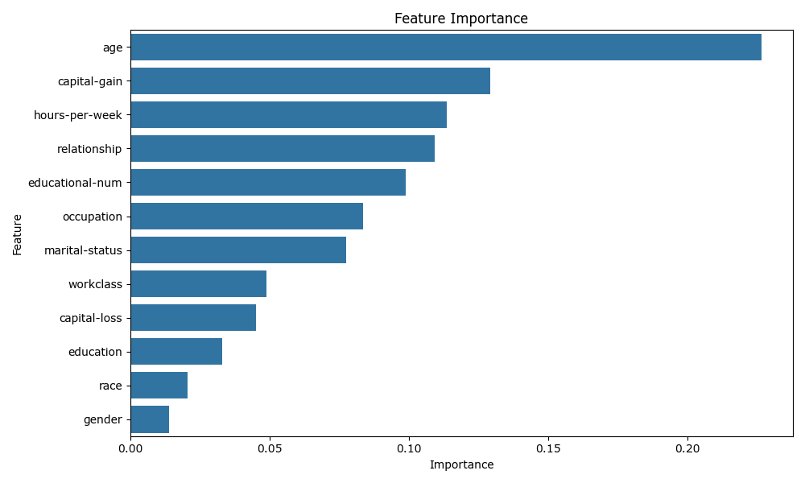
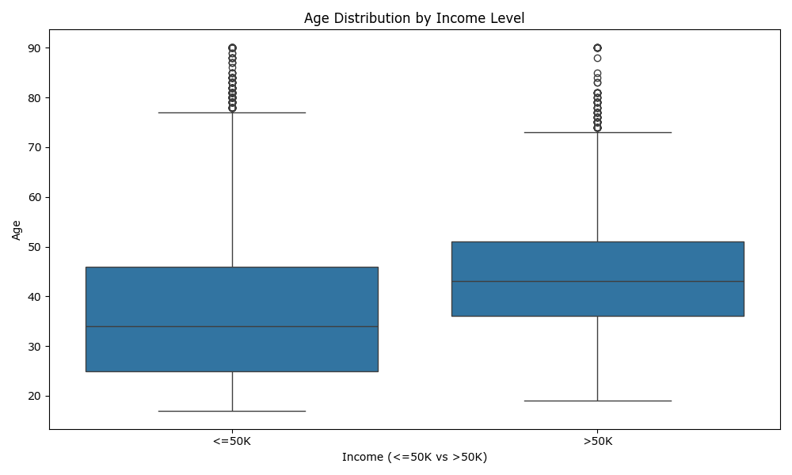

💰 Salary Prediction Web App

A Flask-based web application that predicts whether a person's salary is above or below ₹50K based on various demographic and employment-related features.

---

🚀 Features

📊 Salary prediction using Machine Learning (Random Forest)

📂 User input form for prediction

📈 Graphs and visualizations using Matplotlib & Seaborn

🔥 Responsive frontend using HTML, CSS, and JS

---

🛠️ Tech Stack

Python

Flask

Pandas, NumPy

Scikit-learn, Joblib

Matplotlib, Seaborn

HTML, CSS, JavaScript

---

📦 1. Clone the Repository

git clone https://github.com/RutujaaPawar18/salary-prediction.git  
cd salary-prediction  

📥 2. Install Dependencies  
  Install the required Python packages:  
  pip install -r requirements.txt  
    
---  
  
🧠 3. Model and Scaler Files  
  
Make sure salary_model.pkl and scaler.pkl files are present in the project directory. These are required for making predictions.  
    
---  
  
▶️ 4. Run the App  
  
Start the Flask development server:  
  
python app.py  
  
The app will run on:  
🔗 http://127.0.0.1:5000  
🗂 Folder Structure  
  
salary-prediction/  
├── app.py  
├── requirements.txt  
├── scaler.pkl  
├── salary_model.pkl  
├── static/  
│   ├── script.js  
│   ├── style.css  
│   ├── feature_importance.png  
│   ├── education_income.png  
│   └── age_income.png  
├── templates/  
│   └── index.html  
├── .gitignore  
└── README.md  

🙋‍♀️ Developed By  
[Rutuja Pawar](https://github.com/RutujaaPawar18) 

## 📊 Sample Visualizations  
  Below are some sample visualizations generated from the dataset to help understand the distribution and relationships between features.  
  
### 🎓 Education vs Income  
  
  
### 📈 Feature Importance  
  
  
### 👤 Age vs Income  
  

## ⚙️ Installation  
  
1. Clone the repository:  
  
```bash  
git clone https://github.com/RutujaaPawar18/salary-prediction.git  
cd salary-prediction